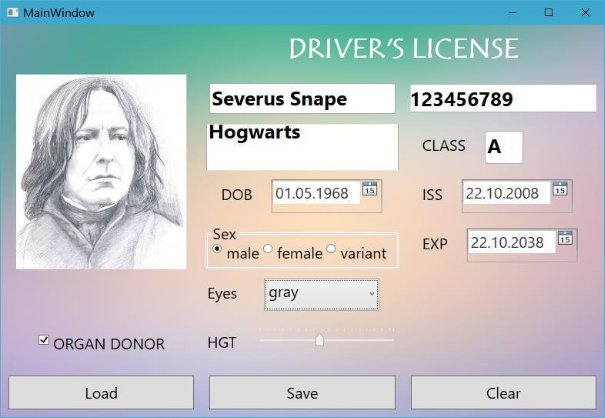

**СВПП. Лабораторная работа 2.  Элементы управления** 

**Цель  работы**.  Ознакомиться  с  основными  элементами  управления,  их свойствами, обработчиками событий. Научиться использовать стандартные окна сообщений. 

**Задание 1. Водительская лицензия** 

1. Разработать форму согласно макету: 

Использовать следующие элементы: Label 

TextBox 

Image 

GroupBox 

RadioButton 

ComboBox 

DatePicker 

CheckBox 

Slider 

Button 

В качестве фона использовать готовый файл .jpg.  

Место картинки заполните каким-либо рисунком по умолчанию. 

2. Создайте отдельный класс для представления объекта Driver. 

Используйте следующие типы данных: 

1. для цвета глаз и гендерной принадлежности – перечисления COLOREYES и GENDER. 
1. для представления даты – DateTime 
1. для согласия на донорство органов – bool. 
1. фото храните как строку (имя файла) 
3. В заоконном коде: 
   1. Создайте объект driver 
   1. Заполните comboBox значениями из перечисления COLOREYES 
3. Настройте обработчики событий: 
1. При щелчке по картинке вызывается диалоговое окно OpenDialog для загрузки нового изображения 
1. По кнопке Save объект driver заполняется значениями из элементов управления и выводится в MessageBox. 
1. По кнопке Load объект driver инициализируется из кода фиксированным набором значений, затем выполняется заполнение всех элементов управления на основании этого объекта. 
1. По кнопке Clear очищаются все элементы управления и объект driver. 

Кнопки должны отрабатываться корректно в любой последовательности. 

**Задание 2. Карточка регистрации (по вариантам)** 

Разработать приложение, аналогичное предыдущему примеру.  Использовать указанный контейнер компоновки как основной (допустимы вложения других контейнеров). Приложение должно содержать следующие элементы управления:  

- Label или TextBlock 
- TextBox 
- Image 
- GroupBox или Expander 
- RadioButton и/или CheckBox 
- ComboBox или ListBox 
- DatePicker 
- Slider  
- Button 

Использовать кнопки для сохранения данных в файл и загрузки из файла через объект соответствующего класса.  

Вариант 1. **Карточка клиента**. Контейнер компоновки - DockPanel.   Вариант 2. **Карточка товара**. Контейнер компоновки - StackPanel.   Вариант 3. **Карточка боевого юнита в компьютерной игре**. Контейнер компоновки - WrapPanel.   

Вариант 4. **Карточка аукционного лота**. Контейнер компоновки - Canvas.   Вариант 5. **Карточка участника выставки собак**. Контейнер компоновки 

- UniformGrid.   

Вариант 6. **Карточка растения для ботанического сада**. Контейнер компоновки - DockPanel.   

Вариант 7. **Карточка студента(Пропуск)**. Контейнер компоновки - StackPanel.   

Вариант 8. **Карточка участника конференции**. Контейнер компоновки - WrapPanel.   

Вариант 9. **Карточка участника соревнований**. Контейнер компоновки - Canvas.   

Вариант 10. **Карточка сотрудника**. Контейнер компоновки - UniformGrid.   
